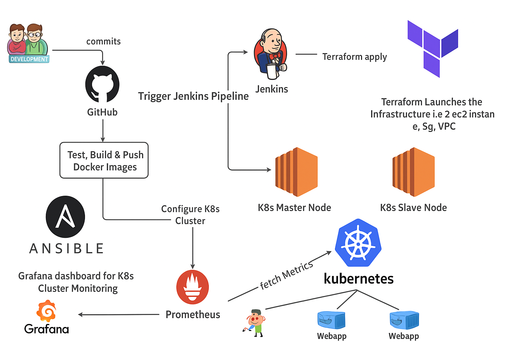

# 🌱 AI-powered Corporate Wellness Dashboard

**A full-stack, cloud-native application to help employees track mood & reduce stress using AI recommendations.**

---

## ✨ Features
- Users log daily mood
- AI-powered suggestions (breaks, music, mindfulness)
- Dashboard of trends & history
- Real-time metrics & logs
- Fully containerized & cloud-deployed

---

## 🏗 Tech Stack
| Layer         | Choice                        |
|---------------|-------------------------------|
| Frontend      | React (TypeScript)            |
| Backend       | Python (FastAPI)              |
| Database      | PostgreSQL                    |
| Containers    | Docker                        |
| Orchestration | Kubernetes (AWS EKS)          |
| CI            | GitHub Actions                |
| CD            | Jenkins                       |
| Infra         | Terraform, Ansible            |
| Observability | Prometheus, Grafana           |
| Security      | SonarQube                     |

---

## 🧭 Roadmap

- ✅ Project skeleton & README
- ✅ Build backend API with FastAPI
- ✅ Build React frontend
- ✅ Dockerize apps
- ✅ Local orchestration with docker-compose
- ✅ Provision CI Pipelines with Github Actions
- ✅ Provision CD with Jenkins
- ✅Provision EKS & RDS with Terraform
- ✅ Add monitoring & logging
- ⬜ Include AI Features (Comming Soon)

---

## 📊 Architecture

---

## ✍️ Author

Ashish Sharma

---
